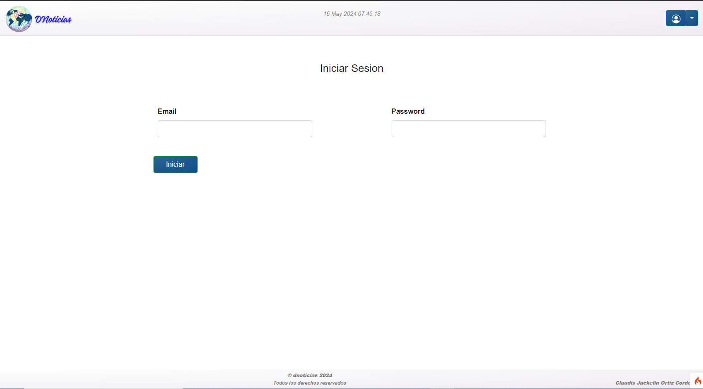

# Técnicatura web UNSL
# Proyecto de máquina codeigniter
## - Técnicas y herramientas
## - Topicos avanzados 

**DNoticias es un proyecto individual para las materias de _Técnicas y herramientas_ y _Tópicos avanzados_. Consiste en desarrollar un sitio web denoticias, bajo el siguiente enunciado:**

> Una empresa tecnológica ha encargado al área de desarrollo un módulo para editar y
> publicar noticias referidas a la empresa. Los requerimientos mínimos de la aplicación son:
> ● Posibilidad de editar una noticia. La noticia tiene un título, descripción, fecha,
> estado, categoría e imagen (opcional).
> ● El usuario editor puede crear o editar noticias propias. Luego puede guardarlas como
> un borrador o como “lista para validar”. También podrá descartar o anular noticias
> que estén en estado borrador, en este último caso las noticias quedarán en estado
> “descartado”.
> ● El estado borrador permite que la noticia pueda volverse a editar en un tiempo
> posterior. resultando en un nuevo borrador o en “lista para validación”.
> ● Un usuario validador puede publicar cualquier noticia lista para validar o marcarlas
> como “para Corrección”. En ningún caso podrá ver las noticias que se encuentren en
> borrador. Las noticias para corregir solo pueden ser editadas por los editores pasando
> luego a borrador o “lista para validar”.
> ● El usuario validador también podrá rechazar una publicación que este en “lista para
> validar” siempre y cuando sea la primera vez.
> ● La aplicación debe permitir llevar un seguimiento completo de los cambios de cada
> una de las noticias pudiendo saber cuáles fueron las modificaciones, quienes y cuando
> las hicieron.
> ● Las noticias estarán publicadas una cierta cantidad de días (parámetro a configurar
> por la aplicación), luego el sistema las pasará a un estado “Finalizadas”.
> ● Si la noticia pasa más de 5 días en “lista para validar” el sistema las publicará
> automáticamente. Solo en estos casos el usuario validador puede “despublicar” o
> cambiar “para Corrección” la noticia (siempre y cuando no haya finalizado).
> ● Además, las noticias tienen un estado que permite describir si el registro de la noticia
> está activo o no. Solo noticias recién creadas que estén en borrador o listas para
> validar podrán ser desactivadas y activadas.
> ● Los usuarios editores no pueden tener más de 3 noticias activas en borrador.
> ● El sistema debe permitir todas las operaciones necesarias para gestionar las noticias,
> incluyendo la posibilidad de deshacer la última operación realizada. (por ej. el usuario
> editor podría dar marcha hacia atrás una publicación que registro como lista para
> validar o por ejemplo un usuario validador podría deshacer una publicación que fue
> publicada).
> Se pide al alumno/grupo desarrollar el módulo con los siguientes requerimientos:
> • Gestión de Noticias.
> • Gestión de Usuarios.
> Gestión de Usuarios.
> La gestión de los usuarios de la aplicación involucra el registro de los usuarios en la
> aplicación ya sea como usuario editor y/o validador. Un usuario puede tener ambos roles.
>
>Todas las características adicionales que pudieran formar parte de la aplicación, como así
>reglas de negocio no definidas serán coordinadas y consensuadas con la cátedra.
>
>Considere que las categorías son estáticas y ya se encuentran preestablecidas en la
>aplicación.

## Configuración

Aplicación desarrollada con el framework Codeigniter 4 y MariaDB.

### Versiones utilizadas

* PHP Version 8.2.4.
* MariaDB 10.4.28.
* Codeigniter v4.5.1.

### Instalación

1. PHP y MariaDB se encuentran disponibles en el paquete [xampp](https://sourceforge.net/projects/xampp/files/XAMPP%20Windows/8.2.4/xampp-windows-x64-8.2.4-0-VS16-installer.exe)
2. Revisar y ajustar configuración de php con
~~~
php spark phpini:check
~~~
3. Una vez completada la instalación, copiar el contenido del repositorio dentro de la carpeta htdocs de xampp
4. Crear una base detos con el nombre 'noticias' y ejecutar el script `sql/noticias(3).sql`
5. Utilizar el navegador preferido para navegar el sitio:  `'http://localhost/PMCodeigniter/public/'`.

### Usuarios De Ejemplo

| Nombre | Email | Clave | es_editor | es_validador |
|----|----|----|----|----|
| Marcos Ortiz | ortizmarcos@gmail.com | Peluche$29 | 1 | 1 |
| Claudis Ortiz | cortiz@hotmail.com | Pasta$29 | 1 | 0 |
| Jose Ortiz | jortiz@gmail.com | Pasta$29 | 1 | 0 |
| Williams Cartaya | wcartaya@gmail.com | Pasta$29 | 1 | 1 |

#### Estados - No Modificable

| ID | Nombre |
|----|----|
| 1 | Validar |
| 2 | Borrador |
| 5 | Publicada |
| 6 | Despublicada |
| 7 | Finalizada |
| 9 | Rechazda |
| 10 | Corregir |
| 12 | Descartado |

#### Categorias - No Modificable

| ID | Nombre |
|----|----|
| 1 | Médicina |
| 2 | Política |
| 3 | Economía |
| 4 | Ciencia |
| 5 | Deporte |
| 6 | Farándula |
| 7 | Planeta |
| 8 | Eventos |
| 9 | Últimas noticias |
| 10 | Salud |
| 11 | Mundo |
| 12 | Arte |
| 13 | Cultura |
| 14 | Tecnología |

### Convenciones

#### Estatus de cuentas de usuario - campo usuario. es_editor

| valor | significado |
|----|----|
| 0 | Usuario no es editor |
| 1 | Usuario es editor |

#### Estatus de cuentas de usuario - campo usuario.  es_validador

| valor | significado |
|----|----|
| 0 | Usuario no es validador |
| 1 | Usuario es validador |

#### Estatus de noticias - campo noticia.  es_activo

| valor | significado |
|----|----|
| 0 | Noticia inactiva |
| 1 | Noticia activa |

#### Usuario Sistema
Es el usuario con id 1, no es modificable.

#### Personalizando el framework

##### Validaciones personalizadas

EL proyecto conteniene reglas de validación propias implementadas en el controlador Noticia.php; estas reglas se escuentran en la carpeta Validators dentro de app como se muestra en la imagen abajo.

 
 

Dentro de la carpeta se encuentra el archivo MisRules.php, como se muestra en la siguiente imagen, y dónde a simple vista se pueden observar los metodos que se implementan en el controlador Noticia.php.

 

##### Configuración personalizada
Para cumplir con el requerimiento de que las noticias que estan en estado 'validar' por cinco días sean publicadas por el sistema y que se debe tener una variable con la que se determine el tiempo de duración de la publicación de dicha noticia, se creo una varible dentro la carpeta config que se encuentra dentro de app. El nombre del archivo es Miconfiguracón.php como se muestran en las imagenes siguientes:

 
  

Luego se consulta en la base de datos quien es el encargado de gestionar todo lo referente con los cambios de estados de las noticias, mediante el modelo EstadoNoticia, tal como se muestra en la siguiente imagen:

 

 Se creo un metdodo en el controlador Noticia, encargado de actualizar los estatus de las noticias.

 

Este método se debe ejecutar periódicamente, para lograr ésto, se generó una tarea en el programador de tareas de windows (en caso de utilizar otro sistema operativo se puede hacer con un _Cron Job_ o similar).

 Las siguientes imagenes muestran el paso a paso de la configuración del programador de tareas de windows, quien es el encargado de ejecutar el metodo actualizarEstadosNoticias(), para que las mismas sean publicadas ó finalizadas por el sistema.

 1. Abrir el programador de tareas y crear una tarea.

 

 2. Asignar un nombre a la tarea que se va a ejecutar y en mi caso seleccione windows 10 que es el que corresponde a mi equipo.
 

 3. Vamos a la pestaña de desencadenadores y vamos a seleccionar nuevo.
 

 4. Se despliega la ventana donde podemos seleccionar la frecuencia y hora de ejecución para la tarea.
 

 5. Pasamos a las acciones, donde seleccionamos nueva.
 

 6. Examinamos para seleccionar el programa o script con el que vamos a ejecutar la tarea. 
 En mi caso seleccione chrome.exe. Y luego en agregar argumento se coloca la ruta que apunta al método que es el encargado de hacer la consulta a la DB (actualizarEstadosNoticias() ubicado en el controlador de Noticia).
 

 7. La ruta a la que apunta, como ejemplo:

localhost\\PMCodeigniter\\public\\noticias\\actualizar_estado_noticia.

### Algunas vistas de la aplicación.

#### Vistas web.
Principal de noticias.

Detalle de noticia.

Crear noticia.

Editar noticia.

Ver cambios entre borradores.

Listado de mis noticias.

Crear usuario.

Iniciar sesion.

#### Vistas mobile.
Principal de noticias

Detalle de noticia.

Editar noticia.

Crear noticia.

Iniciar sesion.

Registro de usuario.

